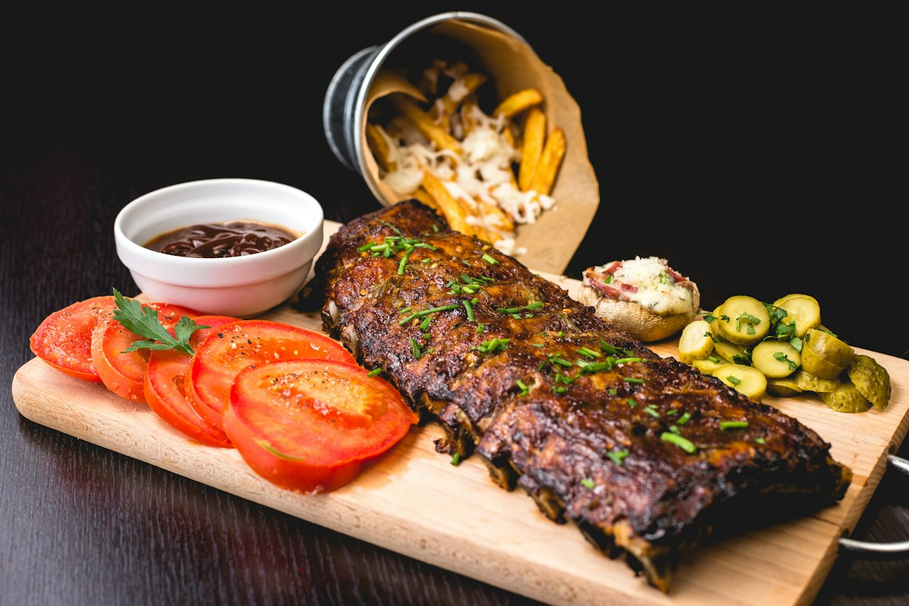

# Grand Cafe — Mandi Bahauddin 🍽️✨

Official modern culinary website for **Grand Cafe**, located on Phalia Road (in Waris Hospital complex), Mandi Bahauddin, Punjab, Pakistan.



---

## 🌟 Highlights & Features

- **Luxury Aesthetic**: Dark culinary theme ("Savoré Kitchen" style) with floating glass pill navbar (`backdrop-filter: blur(16px)`).
- **Responsive Navigation**: Adaptive mobile drawer navigation with animated hamburger-to-X menu and auto-hiding tagline for small screens ($\le 430\text{px}$).
- **Editorial Hero Section**:
  - Gold metallic eyebrow (`— BOLD SPICES, REAL TASTE`).
  - Serif headline *Experience Authentic Flavors* with crimson red accent underline.
  - Floating 30-min express delivery chip with curved arrow.
  - Floating customer reviews card (4.9 / 5 with customer avatars).
  - Ambient glowing sizzling dish platter with floating spice elements.
- **4-Card Glass Feature Strip**: Fast Delivery, Fresh Ingredients, Expert Chefs, and WhatsApp Online Ordering.
- **3D CoverFlow Carousel**:
  - Interactive 3D perspective showcasing Best Sellers (Grand Special Pizza, Crunchy Zinger Burger, Matka Fries, Creamy Alfredo Pasta, Specialty Coffee).
  - Background ambience blur effect matching current active card.
  - Touch swipe gestures, keyboard arrow navigation, and 5000ms auto-play.
- **Luxury About Section**:
  - Chef signature cursive script.
  - Rotating circular text badge with crimson play button.
  - Dual luxury showcase cards for signature dishes and dining reservations.
- **Live Hours Tracker**: Automatically calculates local time to display live open/closed status (11:00 AM – 2:00 AM daily).
- **Interactive Menu & WhatsApp Direct Ordering**: Categorized menu tabs (All, Pizza, Burgers, Fries, Pasta, Drinks) with pre-filled WhatsApp ordering messages.
- **shadcn / React Support**: Includes `components/ui/3-d-coverflow-carousel.tsx` and `components/demo.tsx` for easy import into Next.js & Tailwind CSS projects.

---

## 📍 Verified Business Information

| Detail | Information |
| :--- | :--- |
| **Business Name** | Grand Cafe |
| **Address** | Phalia Road, In Waris Hospital complex, Mandi Bahauddin, Punjab, Pakistan |
| **Plus Code** | `HFGH+2C Mandi Bahauddin, Pakistan` |
| **Phone / WhatsApp** | `+92 304 5484444` |
| **Operating Hours** | 11:00 AM – 2:00 AM Daily |
| **Price Range** | Rs 1,000 – 2,000 per person |
| **Rating** | 3.7 ★ (123 Google Reviews) |

---

## 📂 Repository Structure

```
grand-cafe/
├── assets/
│   ├── avatar1.jpg - avatar4.jpg     # Reviewer avatar portraits
│   ├── burger-coverflow.jpg          # Crunchy Zinger Burger
│   ├── coffee-coverflow.jpg          # Specialty Coffee & Shakes
│   ├── flaming-wok.jpg               # Live Cooking Wok (About Us)
│   ├── fries-coverflow.jpg           # Matka Fries
│   ├── hero-sizzler.jpg              # Hero Sizzling Platter
│   ├── media_1789847863010.jpg       # Official Grand Cafe Logo
│   ├── pasta-coverflow.jpg           # Creamy Alfredo Pasta
│   ├── pizza-coverflow.jpg           # Grand Special Pizza
│   └── signature-spices.jpg          # Signature Spices (About Us)
├── components/
│   ├── demo.tsx                      # React Demo component
│   └── ui/
│       └── 3-d-coverflow-carousel.tsx # shadcn/Tailwind React component
├── index.html                        # Main HTML5 landing page with Schema.org JSON-LD
├── media_1789847863010.jpg           # Root fallback logo
├── script.js                         # Production Vanilla JS
├── style.css                         # Production CSS3 stylesheet
└── README.md                         # Project documentation
```

---

## 🚀 Getting Started

Simply open `index.html` in any modern web browser or host it via GitHub Pages, Vercel, or Netlify. Zero build step or npm install required for the static website!
